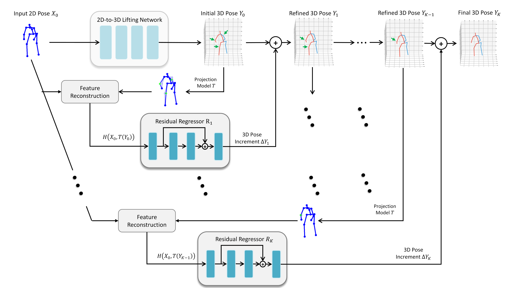

# ERD 3DPose

This project is the official implementation of Explicit Residual Descent for 3D Human
Pose Estimation from 2D Joint Locations.




### Datasets

 * Human3.6M

## Dependencies

* Python 2.7
* PyTorch >= 1.1.0

## Installation

1. First, clone this repository:
    ```
    git clone https://github.com/ky66111/ERD_3dpose.git
    cd ERD_3dpose
    ```
2. Install requirements:
    ```
    pip install -r requirements.txt
    ```
3. Download the pre-processed [Human3.6M](https://1drv.ms/u/s!AueMCSJ2EDkShMhQW0m8jFia80tnaQ?e=JT1WzU) pose data (no image) and extract it into `./data`:
    ```
    cd ./data/
    unzip ERD_data.zip
    ```

4. (Optional) Download [pretrained model](https://1drv.ms/u/s!AueMCSJ2EDkShMhPb6lQSixXTTBi0g?e=mrTSsh) and extract it into `./checkpoint`:
    ```
    cd ./checkpoint/
    unzip checkpoint.zip
    ```

#Results
Here are the results of released pretrained model correspoding to Table 3 in the paper.

| **Lifting Network** | **Root Joint Locations** | **Weights&Error on GT2D** | **Weights&Error on DET2D** | **Note** |
|:-------------------:|:------------------------:|:-----------------:|:------------------:|:------------------:|
| Martinez et al.     | GTRoot | ERD(lifting) : 32.6(37.6) | ERD(lifting) : 50.0(53.5)        | Use PCA|
| Ci et al.           | GTRoot | ERD(lifting) : 35.4(39.1) | ERD(lifting) : 50.2(53.4)    |
| Zhao et al.         | GTRoot | ERD(lifting) : 37.4(40.7) | ERD(lifting) : 52.9(56.6)    |
|                     |                          |                   |                    |


## Experiment
####Training lifting model 
1\. For different input source of 2D pose, change ```--input```
```gt
python main.py --exp lifting_linear_gt --stage lifting  --lifting_model linear --input gt
``` 
```cpn
python main.py --exp lifting_linear_cpn --stage lifting --lifting_model linear --input cpn
```
2\. For different lifting model network structure, change ```--lifting_model```
```lcn
python main.py --exp lifting_lcn_gt --stage lifting --lifting_model lcn --knn 3 --hidsize 64 --input gt
```
```semgcn
python main.py --exp lifting_semgcn_gt --stage lifting --lifting_model semgcn --num_block 4 --hidsize 128 --input gt
```

####Testing lifting model
```linear, gt
python main.py --exp eval_lifting_linear_gt --test --lifting_model linear \
               --input gt --load checkpoint/lifting_linear_gt/ckpt_best.pth.tar
```


---
####Training residual regressors
1\. For different feature reconstruction type (Table 2 in the paper), change ```--inc_input_type```
```Proj2D
python main.py --exp ERD_linear_gt_proj --stage increment \
               --lifting_model linear --input gt \
               --load checkpoint/lifting_linear_gt/ckpt_best.pth.tar \
               --inc_input_type proj
```
```Residual
python main.py --exp ERD_linear_gt_delta --stage increment \
               --lifting_model linear --input gt \
               --load checkpoint/lifting_linear_gt/ckpt_best.pth.tar \
               --inc_input_type delta
```

---
####Testing residual regressors
```
python main.py --exp eval_ERD_linear_gt_delta --test --stage increment \
               --lifting_model linear --input gt \
               --load checkpoint/lifting_linear_gt/ckpt_best.pth.tar \
               --load_inc checkpoint/ERD_lifting_linear_gt/ckpt_best.pth.tar
```
---

####Using PCA to normalize input data
When ```stage=lifting```
```
python main.py --exp lifting_linear_gt_pca --stage lifting  --lifting_model linear \
               --input gt --pca_input --pca_component 30
```
When ```stage=increment```
```
python main.py --exp ERD_linear_gt_pca_proj --stage increment \
               --lifting_model linear --input gt \
               --load checkpoint/lifting_linear_gt_pca/ckpt_best.pth.tar \
               --inc_input_type proj --pca_input --pca_component 30
```


## Citing
If you find this code useful for your research or the use data generated by our method, please consider citing the following paper:
```
@Inproceedings{kang2020ERD,
  Title          = {Explicit Residual Descent for 3D Human Pose Estimation from 2D Joint Locations},
  Author         = {Yangyuxuan, Kang and Anbang, Yao and Shandong, Wang and Ming, Lu and Yurong, Chen and Enhua, Wu},
  Booktitle      = {BMVC},
  Year           = {2020}
}
```